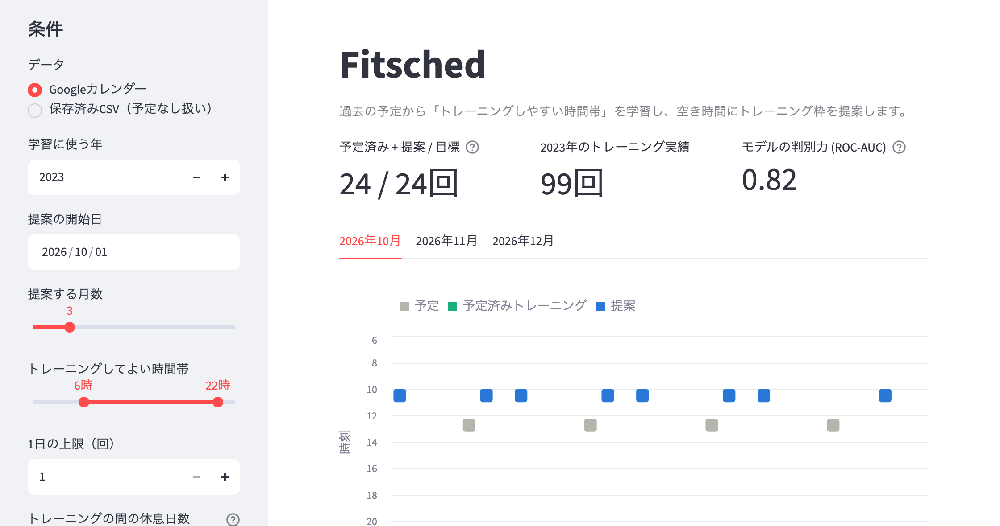

# Fitsched

Googleカレンダーの過去の予定から「トレーニングをしやすい時間帯」を学習し、
これからの空き時間にトレーニング枠を提案するツールです。



## すぐに試す（デモ）

カレンダーの認証情報が無くても、疑似カレンダー（`code/synth.py`）でそのまま動きます。

```sh
python3 -m venv .venv
.venv/bin/pip install -r code/requirements.txt

.venv/bin/streamlit run code/app.py        # 画面で使う（http://localhost:8501）
.venv/bin/python code/fitsched.py          # コマンドラインで使う
```

画面では、期間・月ごとの目標回数・トレーニングしてよい時間帯を変えると、その場で提案が更新されます。
`http://localhost:8501/?start=2026-10-01` のように URL で提案の開始日を指定することもできます。

## データの選び方

`--source auto`（既定）は、次の順に使えるものを選びます。

| モード | 条件 | 内容 |
|---|---|---|
| `google` | `data/credentials.json` か `data/token.json` がある | Googleカレンダーから学習用の年と提案期間の予定を取得 |
| `csv` | `data/2023_calendar_events.csv` がある | 保存済みの予定で学習（提案期間は予定なし扱い、`--future-csv` で指定も可） |
| `demo` | 上のどちらも無い | 疑似カレンダーで学習・提案 |

CSV は `start,end,summary` の3列です（例: `2023-04-10 10:00:00,2023-04-10 11:00:00,トレーニング`）。
`summary` に「トレーニング」を含む予定を、トレーニングの実績として扱います。
終日の予定は時間を占有しないので除きます（CSV では終日予定も日時で保存されるため、0時ちょうどに始まり0時ちょうどに終わる予定を終日とみなします）。

```sh
.venv/bin/python code/fitsched.py --start 2026-10-01 --months 3
.venv/bin/python code/fitsched.py --source csv --history-csv my_events.csv --future-csv my_future.csv
```

主なオプション: `--months`（開始月を含む提案月数）/ `--goal`（1か月の目標回数）/ `--history-year`（学習に使う年）/ `--rest-days`（練習の間に空ける休息日数）/ `--plot`（時間帯のヒストグラムを表示）

提案期間は開始日から、開始月を1か月目として数えた月末までです。月の途中から始める月は、目標回数を日数で按分します。

### Googleカレンダーから取得する場合

1. Google Cloud Console で Calendar API を有効化し、OAuth クライアント（デスクトップアプリ）を作成
2. ダウンロードした JSON を `data/credentials.json` として置く
3. 実行するとブラウザで認証が開き、`data/token.json` が保存される

Googleカレンダーから取得した学習用の予定は `data/{年}_calendar_events.csv` にも保存され、次回からオフラインでも試せます。

`data/` は `.gitignore` 済みです（個人の予定・認証情報を含むため）。

## 仕組み

1. **学習データ**: 学習に使う年を1時間ごとの枠に分け、「トレーニング」の予定と重なる枠を正例にします。
   深夜（22〜6時）とほかの予定と重なる枠はそもそも候補にならないので、学習から除きます。
2. **特徴量**: 時刻・曜日・週末かどうか・同じ日の直前の予定からの間隔・直後の予定までの間隔・その日の予定の合計時間の6つ。
   「授業の直後に行く」「直後に予定があると避ける」といった習慣を捉えるためです。
3. **モデル**: ランダムフォレスト（300本、葉の最小サンプル数20）。
4. **提案**: 提案期間の空き枠を、予測確率の高い順に、月ごとの目標回数・1日の上限・休息日（前後の日を空ける）を守って選びます。
   カレンダーに入っているトレーニングは目標回数に数えます。休息日を守ると目標に届かない月だけ、休息日を1日ずつ減らして埋めます。

## 評価

トレーニングの枠は候補全体の数%しかないため、正解率ではなく並び順の指標（ROC-AUC・Average Precision）で見ます。
評価は**月ごとに分けた交差検証**です。評価する月のデータは学習に使わないので、
ランダムに分ける場合と違い、隣り合う時間枠から答えが漏れにくくなります（月の境目の枠だけは隣の月と接します）。

| データ | ROC-AUC | Average Precision（当てずっぽうの値） |
|---|---|---|
| 作者の実カレンダー（2023年、トレーニング99回） | 0.82 | 0.13（0.03） |
| 疑似データ seed=0 | 0.64 | 0.034（0.022） |

疑似データは「朝型・授業直後・週末夕方」という決まった習慣でトレーニングを入れているため、
各枠の本当の確率が分かります。`code/evaluate.py` では、モデルの予測がその並び順をどこまで再現できるか（正解との相関）と、
本当の確率を使った場合の上限も一緒に出し、特徴量や評価方法の良し悪しを確かめています。
初版（2024年）は24時間すべての枠をランダムに分けて評価しており、数値が実力より高く出ていたため、今の評価方法に改めました。

```sh
.venv/bin/python code/evaluate.py
```

## テスト

```sh
.venv/bin/pip install -r code/requirements-dev.txt
.venv/bin/python -m pytest tests
```

## ファイル構成

```
code/fitsched.py     学習・提案の本体とコマンドライン
code/app.py          Streamlit の画面
code/synth.py        検証・デモ用の疑似カレンダー生成
code/evaluate.py     特徴量・評価方法の比較
tests/               予定の重なり判定・終日予定・提案の制約などのテスト
docs/img/            README のスクリーンショット
Fitsched.command     macOS で画面をダブルクリック起動するためのファイル（.venv を作成済みの前提）
```

## ライセンス

MIT License
